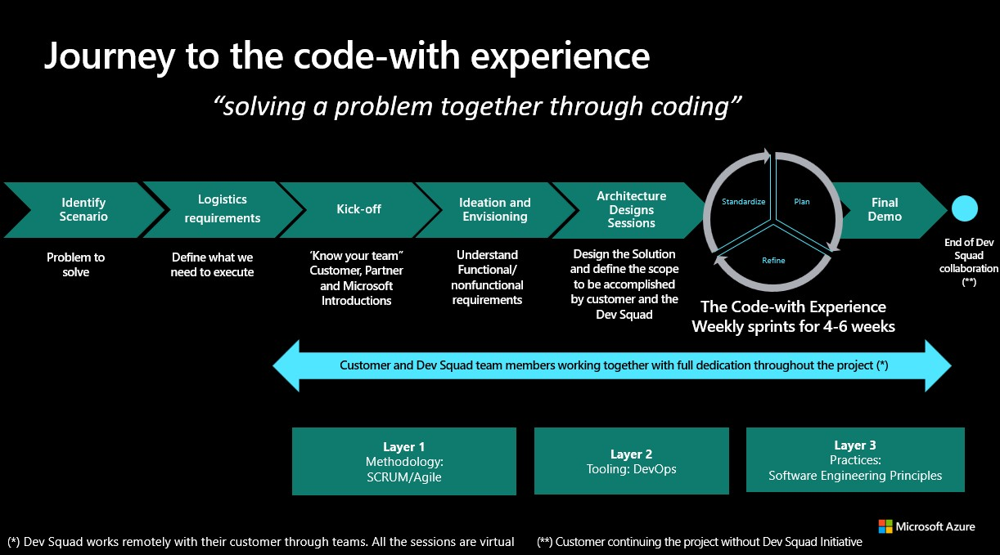
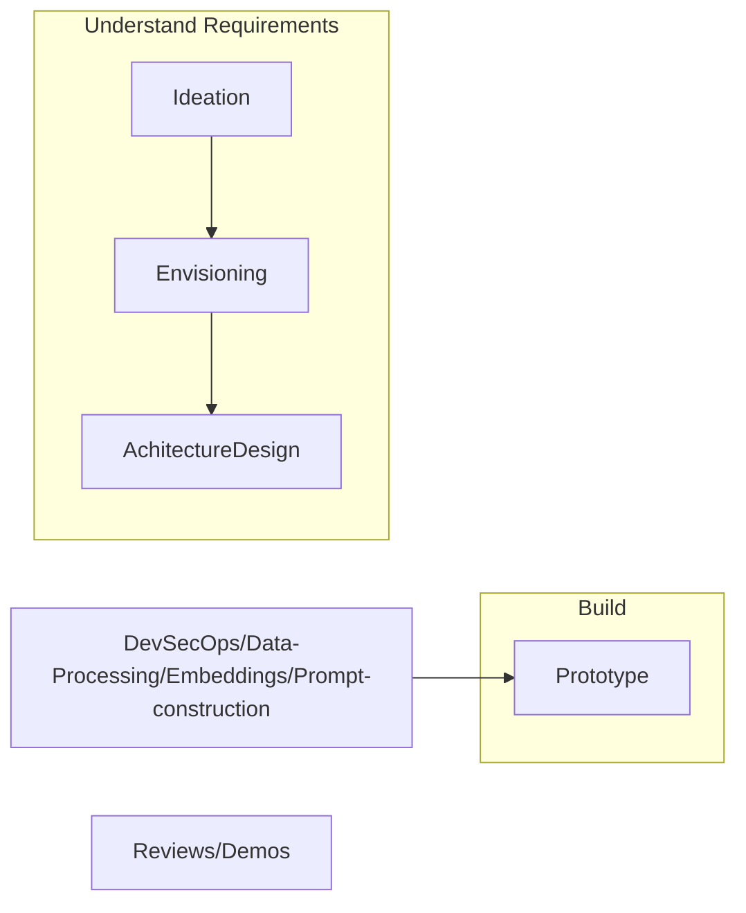
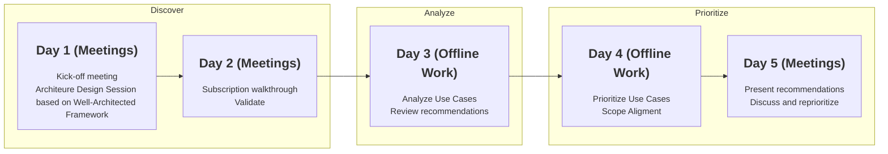

# DevSquad Model Partner-Led Guide

> ⚠️**Work in progress** \
This guide is still incomplete.

The DevSquad Model Partner-Led contains a process to help partners to implement DevSecOps and Best Practices de build and deploy best in class projects on Azure. You can find a detailed explanation on how to use this guide in the "Issue Template" 

This guide is intended to provide you with a step-by-step process to implement a mvp based on DevSecOps and Software Egineering Best Practices.

In the DevSquad Jouney we define seven phases:

* Identify Scenario: Means pinpointing specific situations where users will interact with the solution, detailing their goals and actions. This helps in understanding user needs and guiding feature development.
* Logistics​ requirements: Refer to the necessary resources, timelines, and processes needed to support the development and delivery of the MVP. This includes aspects like team roles, tools, and Azure Tenant.
* Kick-off​ / Ideation and Envisioning: Involves brainstorming and conceptualizing innovative ideas for the MVP, defining its core features and user experience. This phase sets the creative direction and vision for the solution.
* Architecture Designs Sessions: Involve collaboratively defining the technical framework and structure of the MVP, ensuring scalability and robustness. These sessions outline system components, their interactions, and integration points.
* Plan/Standardize/Refine (Code-With phase): Involves creating a detailed roadmap for the MVP, establishing consistent development practices, and continuously improving processes and features based on feedback. This ensures a structured and efficient soft development work.
* Final Demo: Presenting the completed MVP to stakeholders, showcasing its features and functionality. This phase concludes with obtaining formal approval and feedback for the MVP's release.

[Spanish Video available about DevSquad Jouney here](https://1drv.ms/v/s!Arx5JRuoZdOEtboV9S0LhgANOkK7Hg?e=LfiP6S)

### DevSquad Model / Code-With Experience

In the DevSquad Model process we define five phases:

1. **Ideation**: Engage and lead ideation, sessions where the business scenario/problem statement is presented, and through Design Thinking and/or Guided Brainstorming the team can define approaches and alternatives on how to solve it..
2. **Envisioning**: Describe “what” will be built together.​ List main functional and non-functional requirements including data understanding and OpenAI Techniques and agree on the general scope of the end solution.​ Generate the “Definition of Done” for an Intelligent App prototype.​
3. **Acgitecture Design**: Series of sessions to review the 3 steps of In-context learning pattern  (Data pre-processing /  embeddings, Prompt construction/  Retrieval, Prompt Execution/  Inference) to define a high-level approach.
4. **Protoype**: Build the prototype alongside the customer, on Azure.
   * 4.1 **DevSecOps**: Build the IaC and application pipelines for the agreed prototype, following DevSecOps and Software Engineering best practices.
   * 4.2 **Data-Processing**: Contextual data pipelines creation/ automatization, feature definition/ implementation
   * 4.3 **Embeddings**: Embedding model experimentation, orchestration framework selection (Semantic Kernel, Langchain, etc.) and skeleton development for embedding Vector database parametrization.
   * 4.4 **Prompt-construction**: Experimentation, Use of Orchestrator framework (Semantic Kernel, Langchain, etc.) or Azure ML Prompt flow to guide the development cycle of AI applications through a well-defined process. Including prompt engineering techniques, meta-prompting, prompt chaining, interfacing with external APIs, retrieving contextual data form vector databases and maintaining  memory across LLMs calls.
6. **Protoype**: Build the prototype alongside the customer, on Azure.

## Prerequisites

If you did not receive any training about Well-Architected Framework, you need first to take one of these two trainings:

* [Well-Architected training for partners][partner-training]
* [Well-Architected leaning path in Microsoft Docs][docs-training]
* [DevOps or DevSecOps Practices](https://learn.microsoft.com/en-us/training/paths/devops-foundations-core-principles-practices/)

After this, check the next points: select your workload, define the scope and people and resources.

### Determine the business motion

Various motivations can drive business transformations that are supported by ai and cloud adoption. Several motivations likely apply at the same time. here a [list of motivatios](https://learn.microsoft.com/en-us/azure/cloud-adoption-framework/strategy/motivations#motivations) for your reference, you can evaluate and assess the potential impacts of the applicable motivations. Your ai and cloud adoption team should meet with the stakeholders, executives, and business leaders and discuss which motivations can help your business's cloud adoption.

### Define the Scope

Doing the complete Ideation and Envisiong phases can be a long process and take a long time to define scope porject. So, it is better to restrain the scope for your project to focus on the most important areas aligned with your current business needs.

### People and resources

Architecture is designed by people, and during the project you will need to review the motivations of some architectural decisions. You need to identify the people and resources that were involved in the current design. The people who own, use, operate and monitor the current deployment are also important in these meetings.

Here's a checklist of what you need before starting a DevSquad Project:

- [ ] List of the people who will be involved in the project
- [ ] Account with conrtibutor access to the azure subscription
- [ ] Initial use case(s) or requirement(es) based on scope defined.

Establish the rhythm of the architecture review and plan each day. Here's an example:

---

[partner-training]: https://www.microsoft.com/azure/partners/well-architected
[docs-training]: https://docs.microsoft.com/en-us/learn/paths/azure-well-architected-framework/
